# Data visualization

**Data visualization** is the use of graphical tools to [represent data](data-presentation.md) in a clear, structured, and meaningful way. It helps reveal patterns, trends, differences, and relationships that may not be immediately visible in tables or raw numbers. In [veterinary biostatistics](veterinary-biostatistics.md), visualizations support decision-making, improve communication, and enhance the interpretation of clinical, epidemiological, and production data. Choosing the appropriate type of graph depends on the nature of the data and the message the researcher intends to communicate.

## Purpose and importance

Data visualization plays a critical role in transforming complex datasets into accessible insights. It allows researchers, veterinarians, and decision-makers to quickly grasp the key features of a dataset—such as [central tendencies](measures-of-central-tendency.md), [variation](measures-of-variability.md), trends over time, and relationships between variables. While tables offer precision, visualizations provide clarity by highlighting patterns that may be obscured by raw numbers.

In veterinary contexts, effective visualization enhances data interpretation across a range of applications. For instance, a bar chart might reveal which chicken-rearing systems are most associated with avian influenza losses, while a line graph can illustrate how chicken mortality progressed over several days during an outbreak. Boxplots can summarize the variability in flock size across villages, and scatterplots may help identify links between farmer education and vaccination practices.

Beyond analysis, visualization also strengthens communication. It enables veterinarians to present findings to farmers, policymakers, or the general public in a way that is intuitive and compelling. This is particularly important in animal health crises, where visual data can support risk communication, encourage biosecurity practices, or guide targeted interventions.

## Pie and doughnut chart

A pie chart is a circular graph divided into slices, where each slice represents a category’s proportion relative to the whole. A doughnut chart is a variation with a hollow center, offering a more modern look and space-efficient labeling without changing the interpretation.

These charts are designed to show parts of a whole, making them useful for highlighting proportions and percentages. For example, they can show the proportion of respondents who are male or female, or the distribution of vaccination status among a group of farmers.

Pie and doughnut charts are most effective when the number of categories is small—ideally between 2 and 4. When more categories are added, it becomes increasingly difficult for the reader to accurately judge the size of each slice, particularly when the differences are subtle. In such cases, a bar chart is more appropriate for comparison. Another important consideration is that pie charts emphasize relative comparison rather than exact values. Therefore, they are best used when proportions—not raw counts—are the focus of communication.

In the example below, the chart displays the proportion of male and female respondents in a veterinary survey. Males make up 45% of the participants, while females account for 55%. This visualization provides a quick, intuitive summary of group representation.

  

    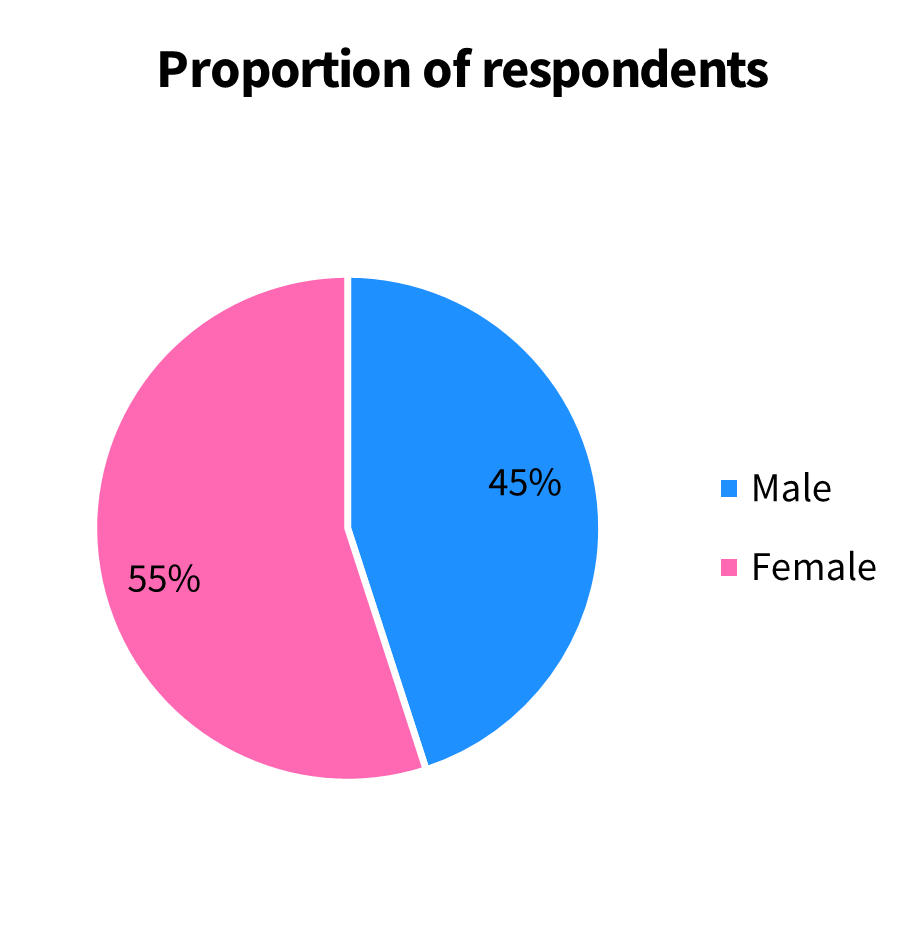
     <em>Figure 1. Pie chart: Proportion of respondents.</em>
  

  

    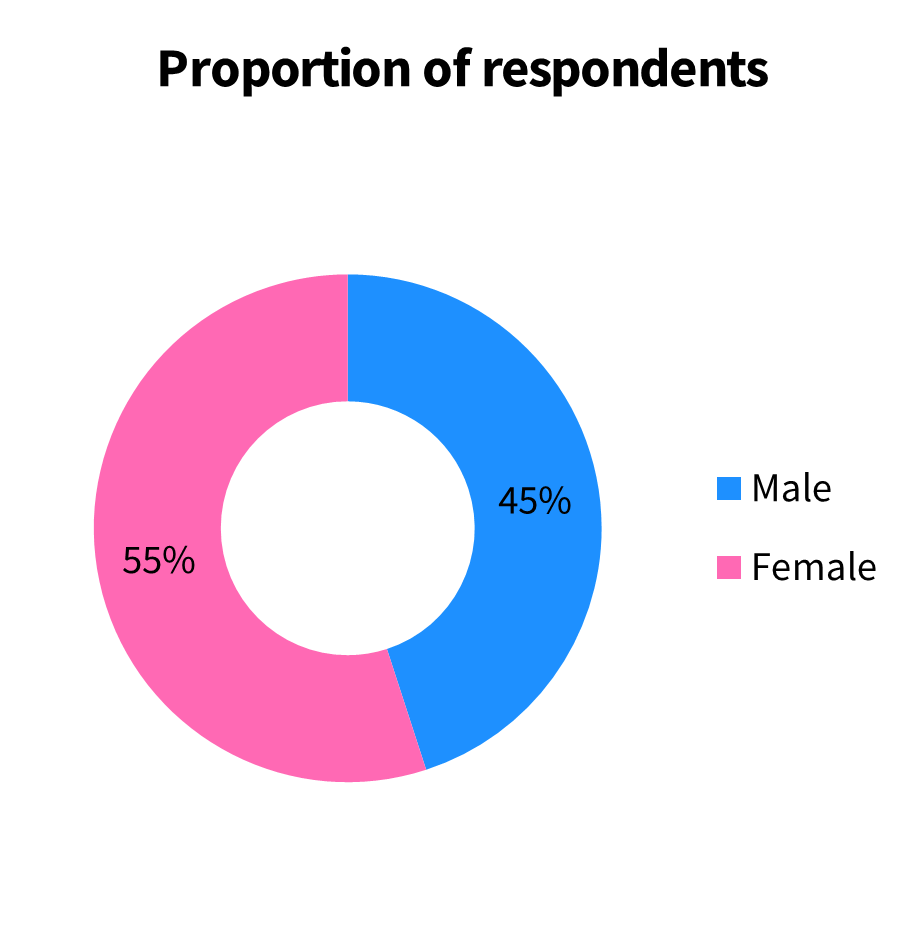
     <em>Figure 2. Doughnut chart: Proportion of respondents.</em>
  

## Bar chart

A bar chart is one of the most common and effective tools for visualizing categorical data. It uses rectangular bars to represent the size or frequency of each category, making it easy to compare values across categories. The bars can be arranged vertically (known as a column chart) or horizontally, and the height (for vertical bars) or length (for horizontal bars) of each bar corresponds to a numerical value.

Bar charts are particularly useful for comparing quantities across categories, highlighting trends over time, or breaking down a total into subcategories. Several variants of bar charts exist, including the regular bar chart, grouped bar chart, stacked bar chart, and 100% stacked bar chart, each offering different strengths depending on the purpose of the analysis.

For example, the bar charts presented in this section are based on a table showing the number of new students admitted to a Veterinary Medicine Study Program over six years (2019–2024), categorized by three admission pathways: SNBP (formerly SNMPTN), SNBT (formerly SBMPTN), and Mandiri.

  <table>
    <thead>
      <tr>
        <th rowspan="2">Year of admission</th>
        <th colspan="3">Admission pathway</th>
        <th rowspan="2">Total number of new students</th>
      </tr>
      <tr>
        <th>SNMPTN/SNBP</th>
        <th>SBMPTN/SNBT</th>
        <th>Mandiri</th>
      </tr>
    </thead>
    <tbody>
      <tr><td>2019</td><td>8</td><td>16</td><td>11</td><td>35</td></tr>
      <tr><td>2020</td><td>15</td><td>40</td><td>21</td><td>76</td></tr>
      <tr><td>2021</td><td>30</td><td>39</td><td>29</td><td>98</td></tr>
      <tr><td>2022</td><td>29</td><td>40</td><td>28</td><td>97</td></tr>
      <tr><td>2023</td><td>33</td><td>40</td><td>26</td><td>99</td></tr>
      <tr><td>2024</td><td>45</td><td>63</td><td>26</td><td>134</td></tr>
    </tbody>
  </table>

The first type of bar chart is the regular bar chart. It shows each category as a separate bar with varying height. The example below displays the total number of new students admitted each year, without differentiating between admission pathways. It uses a single bar per year, allowing a straightforward view of how class size has grown over time—from just 35 students in 2019 to 134 in 2024. This format is especially suited for simple comparisons across categories.

  

    
     <em>Figure 3. Bar chart: Number of new students per admission year.</em>
  
 

The second chart is a stacked bar chart, where each bar represents a category and is subdivided into segments according to subcategories—in this case, the admission pathways. While it maintains the basic structure of a regular bar chart, the internal segments provide additional insight into the composition of each category. This format allows viewers to examine both the total class size and the relative contribution of each admission pathway. For example, it reveals that SNBP showed significant growth in 2021 and 2024, SNBT consistently accounted for the largest share, and the Mandiri pathway remained relatively stable across the years.

  

    
     <em>Figure 4. Stacked bar chart: Number of new students by admission pathway per admission year.</em>
  
 

The grouped bar chart—also known as a clustered or side-by-side bar chart—displays separate bars for each subcategory within each category. In this context, each year contains three adjacent bars representing the admission pathways. This arrangement is particularly useful for comparing the same subcategory across multiple categories or analyzing within-category differences more precisely than is possible with stacked bars. In the example below, this chart format helps highlight fluctuations in the number of students admitted through each pathway over time.

  

    
     <em>Figure 5. Grouped bar chart: Number of new students by admission pathway per admission year.</em>
  
 

The final variant is the 100% stacked bar chart. Unlike the previous formats, this version emphasizes the relative proportions of each subcategory rather than absolute numbers. Each bar has the same height, and the segments represent the percentage composition of admission pathways within each year. This format is particularly helpful when the focus is on composition rather than total size. From the chart, it is clear that the proportion of SNBT remained dominant across the six years, the share of SNBP increased in 2024, and the relative contribution of Mandiri declined slightly.

  

    
     <em>Figure 6. 100% stacked bar chart: Proportion of new students by admission pathway per admission year.</em>
  
 

In some cases, a horizontal bar chart may be more effective than the traditional vertical format. Horizontal bars are particularly helpful when category names are long or when the number of categories is large, as they allow better use of space and improve readability. This format also avoids crowding labels along the x-axis, which can become difficult to interpret in vertical charts. Like vertical bar charts, horizontal bar charts can also be modified into grouped, stacked, and 100% stacked versions, offering the same analytical benefits while improving clarity in situations where horizontal orientation is preferable.
An example is shown below using data from the 2020 Indonesian population census, which lists the ten provinces with the highest population. Since the province names are relatively long and the number of categories reaches ten, the horizontal format ensures that each label remains clear and legible. Each bar represents the total population of a province, making it easy to compare across regions.

In some cases, a horizontal bar chart may be more effective than the traditional vertical format. Horizontal bars are particularly helpful when category names are long or when the number of categories is large, as they allow better use of space and improve readability. This format also avoids crowding labels along the x-axis, which can become difficult to interpret in vertical charts. Like vertical bar charts, horizontal bar charts can also be modified into grouped, stacked, and 100% stacked versions, offering the same analytical benefits while improving clarity in situations where horizontal orientation is preferable.

An example is shown below using data from the 2020 Indonesian population census, which lists the ten provinces with the highest population. Since the province names are relatively long and the number of categories reaches ten, the horizontal format ensures that each label remains clear and legible. Each bar represents the total population of a province, making it easy to compare across regions.

  

    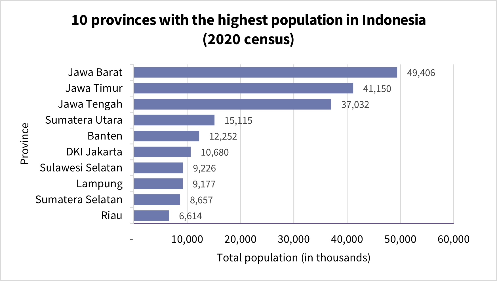
     <em>Figure 7. Horizontal bar chart: 10 provinces with the highest population in Indonesia based on 2020 census.</em>
  
 

## Line chart

A line chart is a graphical tool used to display data points connected by straight lines, often used to visualize changes or trends over time. Each point on the chart represents a value at a particular time, and the connecting lines make it easy to see increases, decreases, or fluctuations. Line charts are especially useful when the data follow a continuous, ordered sequence—such as days, months, or years—making them ideal for tracking patterns over time.

In the context of veterinary education, line charts can be used to show trends such as enrollment over the years, disease incidence across seasons, or changes in production indicators. The examples in this section use the same dataset on the admission of new students to a Veterinary Medicine Study Program from 2019 to 2024.

  

    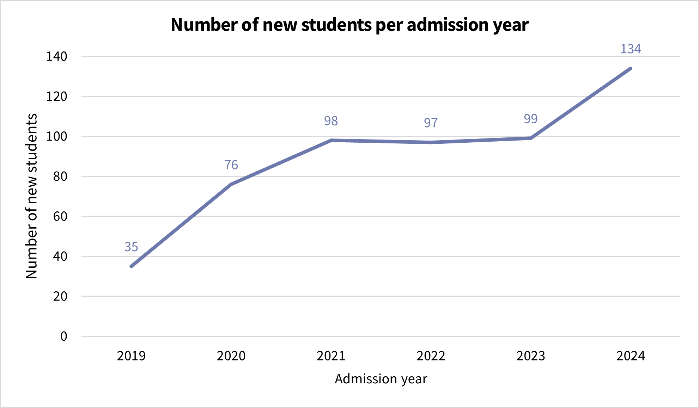
     <em>Figure 8. Line chart: Number of new students per admission year.</em>
  
 

  The first chart above is a regular line chart that shows the total number of new students admitted each year. The line connects six data points, making it easy to observe trends over time. In this case, we can see a sharp increase from 2019 to 2021, followed by a slight plateau, and then another rise in 2024. This format clearly highlights the general trend and direction of change.

  

    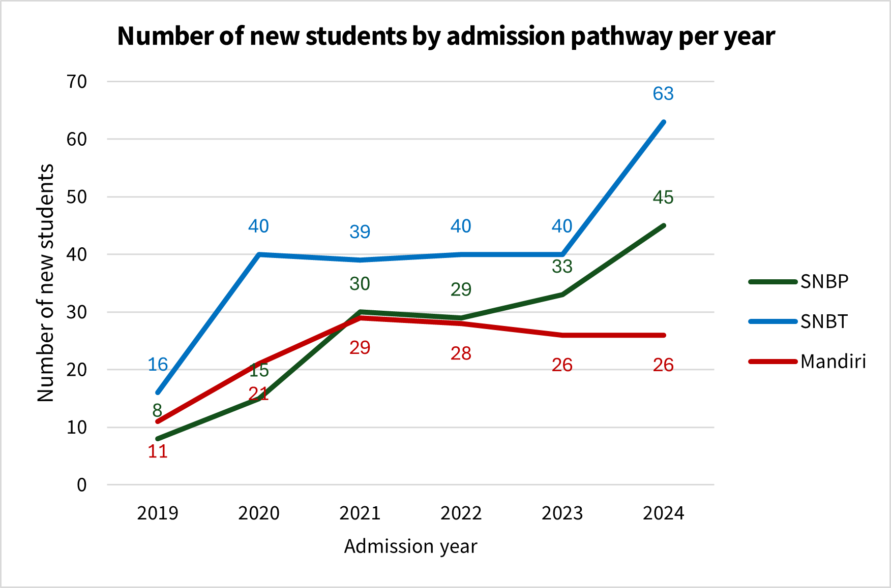
     <em>Figure 9. Multiple line chart: Number of new students by patway admission per admission year.</em>
  
 

  The second chart above is a multiple line chart, which includes one line for each admission pathway—SNBP, SNBT, and Mandiri. This format allows viewers to compare the trends of each subgroup across the same time period. It becomes evident, for example, that the SNBT pathway consistently contributed the most students, while the SNBP pathway saw significant growth in recent years. The Mandiri pathway, on the other hand, remained relatively stable. Multiple line charts are particularly valuable when comparing how different groups change over time under similar conditions.

## Boxplot

A boxplot, also known as a box-and-whisker plot, is a powerful graphical method used to display the distribution, [central tendency](measures-of-central-tendency.md), and [variability](measures-of-variability.md) of numerical data. It summarizes a dataset using five key statistics: the minimum, first quartile (Q1), median (Q2), third quartile (Q3), and maximum. These elements are visualized through a central box—spanning from Q1 to Q3—representing the [interquartile range](measures-of-variability#the-interquartile-range.md) (IQR), and two lines, or “whiskers,” that extend to the minimum and maximum values that fall within a defined range. The median is drawn as a horizontal line within the box, helping users quickly see where the middle of the dataset lies.

  

    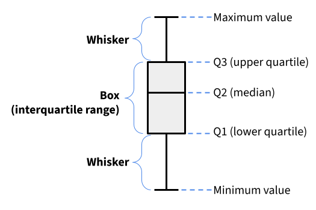
     <em>Figure 10. General structure of a boxplot.</em>
  
 

Boxplots are especially valuable in veterinary biostatistics and animal health research because they allow quick comparison of distributions between different variables or groups. They are well suited for identifying data symmetry, spotting skewed distributions, and detecting outliers. Outliers are typically plotted as individual dots when they fall outside the range defined by 1.5 times the IQR above Q3 or below Q1.

To illustrate, consider data collected from 40 cattle owners in a rural area (<a href="https://docs.google.com/spreadsheets/d/1mNotTBMRGOvEGVj-B1d4Dt3IbwCnq47pZq_RK1q8SZE/edit?usp=sharing" target="_blank">link for the dataset</a>), where three continuous variables were measured: age of cattle owners (in years), years of experience rearing cattle, and number of cattle owned. Boxplots provide a clear visual summary of each variable. Figure 11 illustrates the distribution of age, displaying the minimum value (18), first quartile (30.5), median (40), third quartile (45.75), and maximum value (59). The symbol X represents the mean, which in this case is approximately 38.75 years. The mean is slightly lower than the median, suggesting a mild skew toward younger ages. The overall distribution appears relatively symmetrical.

In contrast, Figure 12 shows the distribution of cattle rearing experience. The mean is about 3.7 years, which is noticeably higher than the median (2.8 years), indicating the presence of some cattle owners with much longer experience that pulls the mean upward. This suggests that the distribution is skewed toward longer rearing experience. The relatively large gap between the upper quartile (Q3 = 5.5) and the maximum value (10.0) further reflects the influence of a few individuals with notably higher values, stretching the upper tail of the distribution.

  

    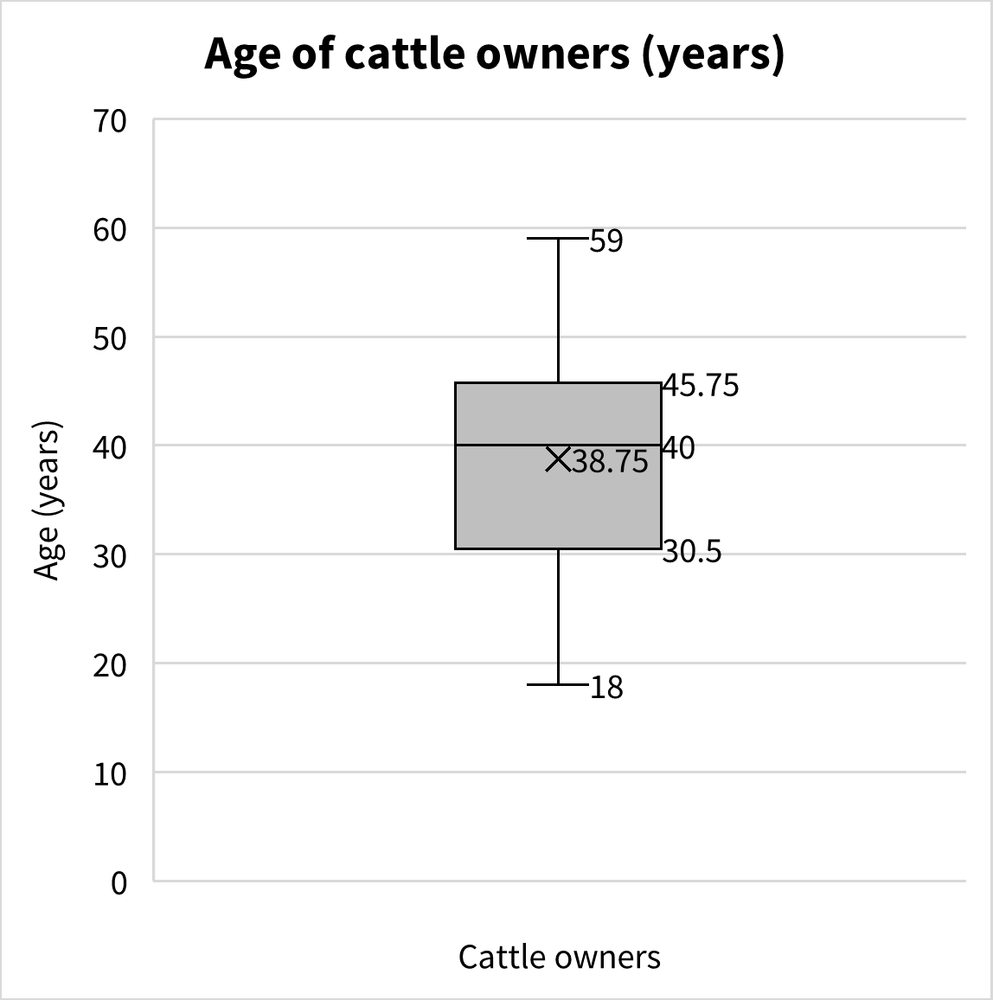
     <em>Figure 11. Boxplot of the age of cattle owners.</em>
  

  

    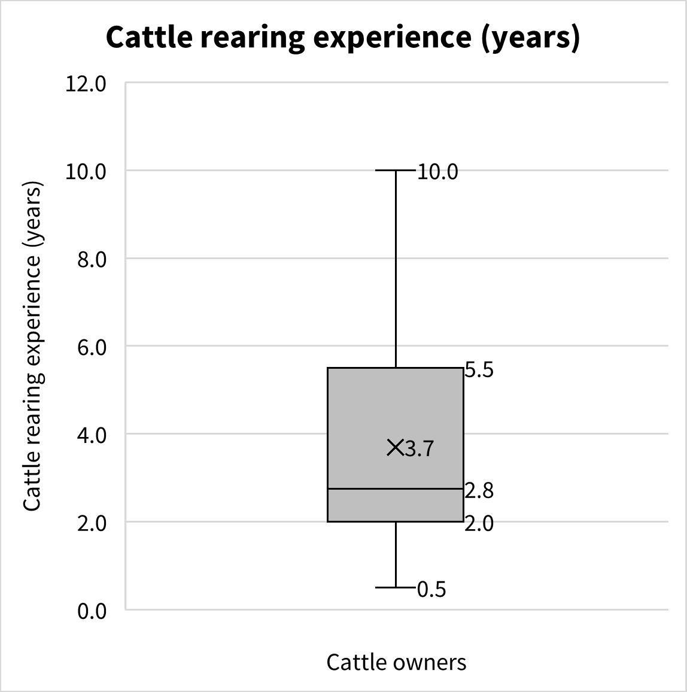
     <em>Figure 12. Boxplot of cattle rearing experience among cattle owners.</em>
  

 

In Figure 13 below, a boxplot is used to display the number of cattle owned by each respondent. The plot shows the minimum value (1), first quartile (5), median (9.5), third quartile (18), and the upper whisker extending to 30. The mean, marked by X, is approximately 13.18. While this boxplot follows the standard structure, the presence of outlier values—marked as individual dots—adds important context to the interpretation. In this case, two outliers are visible: one respondent owns 41 cattle, and another owns 50. These values fall outside the typical range, defined as greater than 1.5 times the interquartile range (IQR) above the third quartile.

In boxplots that display outliers, the whiskers do not extend to the actual maximum or minimum values in the dataset. Instead, they extend only to the most extreme values that are still within the acceptable range—those not classified as outliers. In this case, although the maximum number of cattle owned is 50, the upper whisker stops at 30, which is the largest non-outlier value. This design helps emphasize that certain data points are exceptional and deserve separate consideration in the analysis.

  

    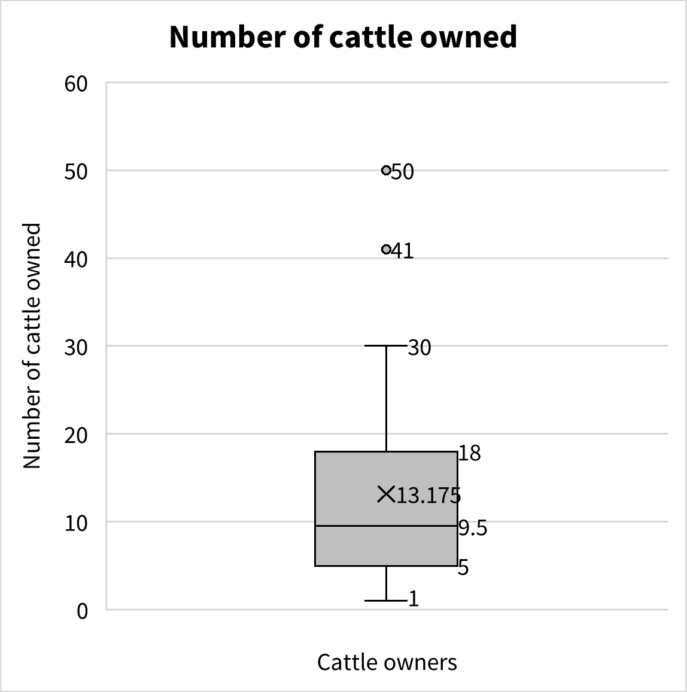
     <em>Figure 13. Boxplot of the number of cattle owned.</em>
  
 

## Histogram

A histogram is a type of graph used to visualize the distribution of a continuous numerical variable. Unlike a bar chart, which is used for categorical data, a histogram groups numeric values into intervals called bins and displays the frequency of observations that fall within each bin. Before constructing a histogram, it is usually necessary to create a frequency table, which counts how many values fall into each interval. The horizontal axis represents the range of values (divided into bins), while the vertical axis shows the number of observations in each bin. The height of each bar corresponds to the frequency of data points in that range. Histograms are particularly useful for understanding the shape of a distribution—whether the data are concentrated in certain ranges, spread out evenly, or contain gaps or unusual values that might not be apparent in summary statistics.

The figures below present histograms based on data from 40 cattle owners, showing the distribution of three continuous variables: age of cattle owners (in years), years of cattle rearing experience, and number of cattle owned.

  

    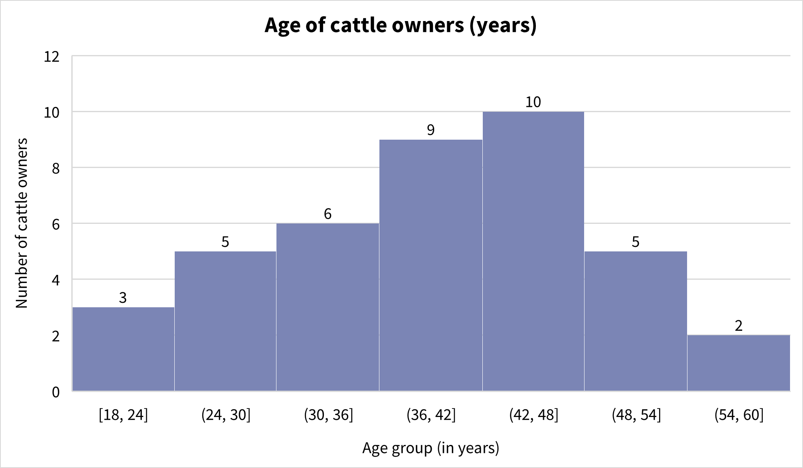
     <em>Figure 14. Histogram of age of cattle owners.</em>
  
 

Figure 14 above shows the distribution of cattle owners by age. The horizontal axis represents age groups in six-year intervals, while the vertical axis shows how many owners fall within each age group. The tallest bars occur between ages 36 and 48, indicating that most cattle owners are in their late 30s to late 40s. The overall shape of the distribution appears relatively symmetrical, with fewer owners in the youngest (18–24) and oldest (54–60) age groups.

  

    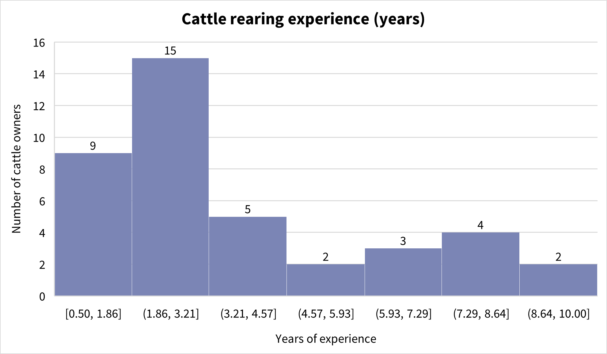
     <em>Figure 15. Histogram of cattle rearing experience.</em>
  
 

Figure 15 above displays the distribution of cattle rearing experience in years. The tallest bar represents the 1.9 to 3.2 years range, which includes 15 respondents. This shows that most cattle owners in the dataset have relatively few years of experience. As experience increases, the number of respondents in each interval becomes smaller, suggesting that extended rearing experience is less common in the group surveyed.

  

    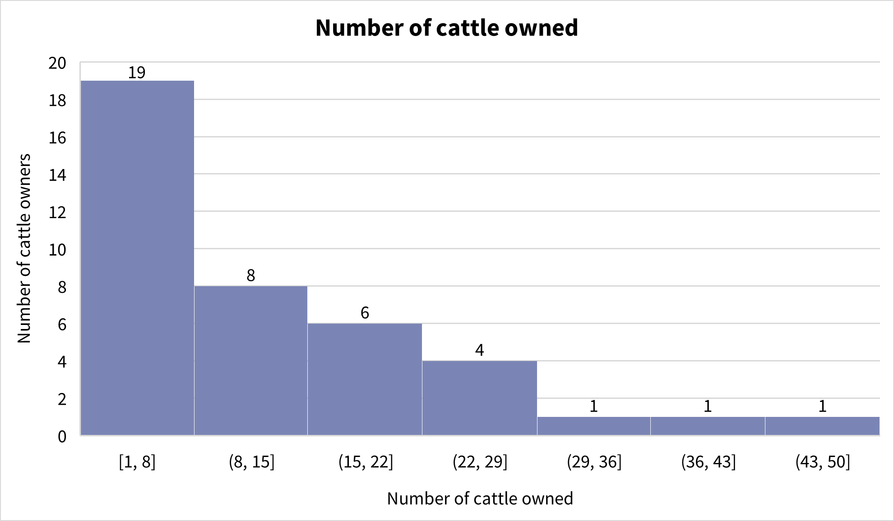
     <em>Figure 16. Histogram of cattle owned.</em>
  
 

Figure 16 above presents the distribution of the number of cattle owned per respondent. Most owners reported smaller herd sizes, with nearly half of them owning between 1 and 8 cattle. As the number of cattle increases, the frequency decreases. Only a few respondents reported owning more than 30 cattle. This histogram highlights that large herds are uncommon, and most cattle owners in the dataset tend to manage a modest number of animals.

## Scatterplot

A scatterplot is a type of graph used to display the relationship between two continuous numerical variables. Each point on the graph represents one observation in the dataset, with its position determined by two values—one on the x-axis and one on the y-axis. Scatterplots are useful for identifying patterns, trends, or potential associations between variables, such as whether one variable tends to increase or decrease as the other changes. They can also help highlight clusters of data points or the presence of outliers.

Scatterplots can reveal relationships between key variables that might not be obvious from summary statistics alone. The examples below use the same dataset from 40 cattle owners.

  

    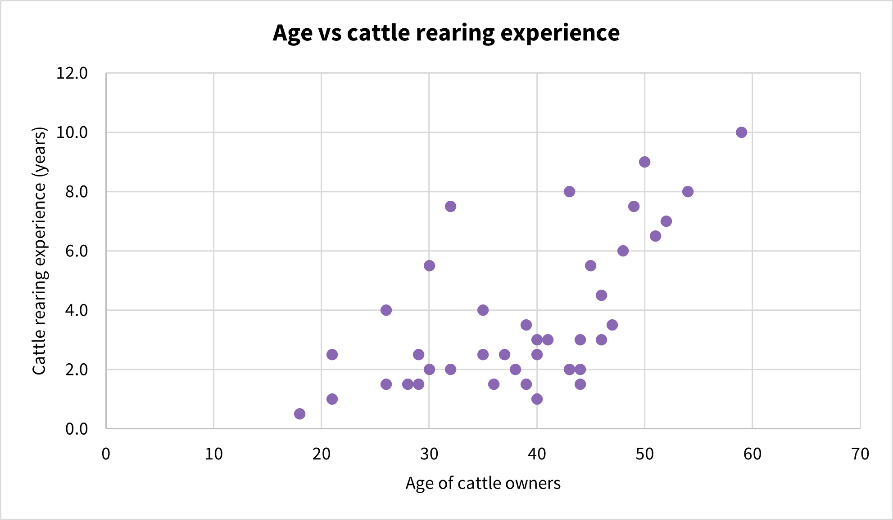
     <em>Figure 17. Scatterplot of age vs cattle rearing experience.</em>
  
 

Figure 17 above shows the relationship between the age of cattle owners (x-axis) and their years of cattle rearing experience (y-axis). Each dot represents one respondent. The general trend indicates that as age increases, rearing experience also tends to increase. However, there is noticeable variability, especially among younger and middle-aged respondents—some older individuals have relatively little experience, while a few younger individuals have already gained several years of experience.

  

    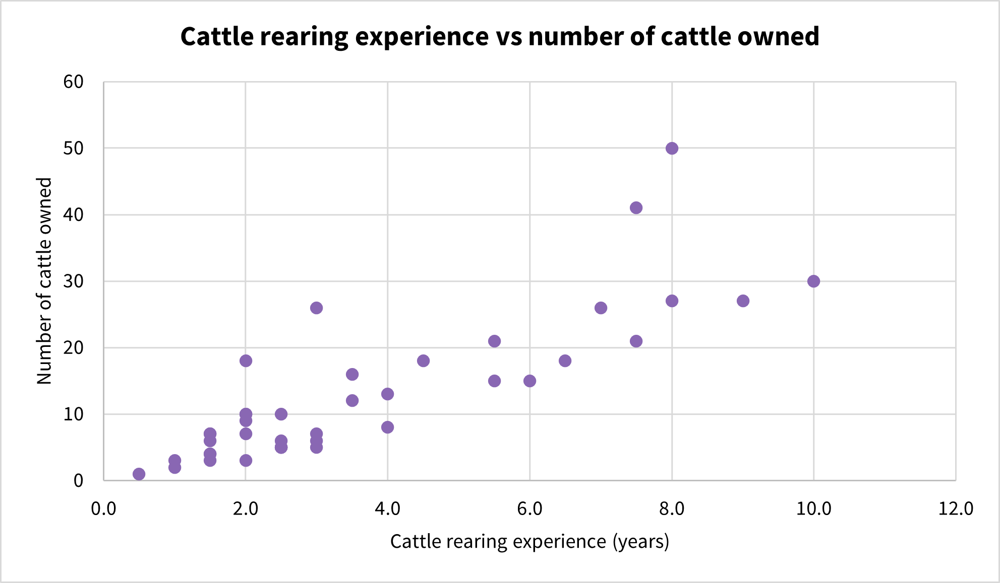
     <em>Figure 18. Scatterplot of rearing experience vs number of cattle owned.</em>
  
 

Figure 18 above compares years of cattle rearing experience (x-axis) with the number of cattle owned (y-axis). This graph suggests that respondents with more years of experience generally tend to own more cattle, though the pattern is not perfectly consistent. Some individuals with low experience own large herds, and vice versa. The points become more widely spread as experience increases, reflecting the diversity in herd size among more experienced farmers.

## Choosing the right visualization

Selecting the right type of visualization depends on several factors, including the nature of the data, the goal of the analysis, and the audience for the results. Each type of chart offers different advantages, and choosing appropriately can make the data clearer, more interpretable, and more impactful.

When working with categorical data, such as sex, village name, or vaccination status, bar charts and pie charts are typically the most effective. Bar charts are best when comparing multiple categories, especially when exact values or small differences are important. Pie charts may be used when showing proportions of a whole, but only when the number of categories is limited and the differences are substantial.

For numerical data, the choice of visualization depends on what aspect of the data is being explored. Histograms are ideal for examining the shape and spread of continuous variables, such as age or number of cattle owned. Box plots are useful for summarizing distributions and identifying outliers. They are especially helpful when comparing multiple groups side by side. Line charts are preferred when visualizing trends over time, such as yearly student admissions or monthly production metrics.

When the aim is to investigate the relationship between two numerical variables, scatter plots are the most appropriate. They allow researchers to see whether changes in one variable are associated with changes in another—for example, whether more experienced cattle owners tend to own more cattle.

The best visualizations are not only technically correct but also well matched to the message they are meant to convey. In veterinary research and practice, clear and accurate data visualization can enhance communication with colleagues, clients, or policymakers and support evidence-based decision-making. By understanding the strengths of each chart type and how to apply them effectively, students and researchers can make their findings easier to interpret and more compelling to their intended audience.