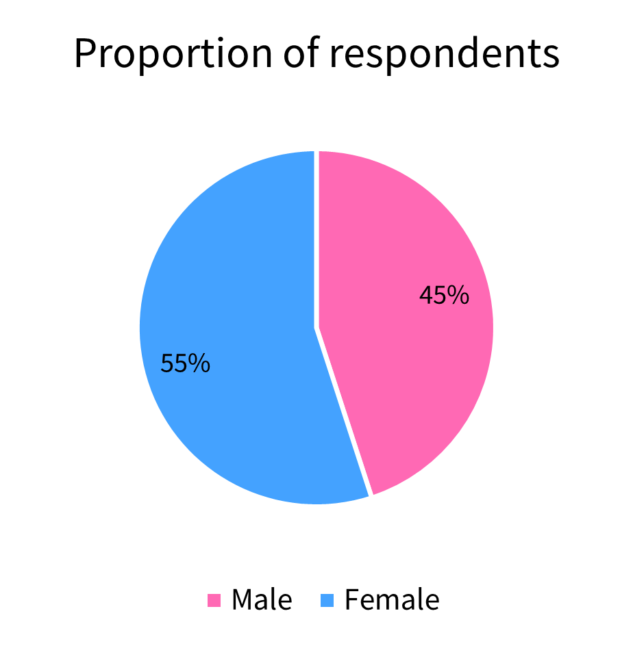
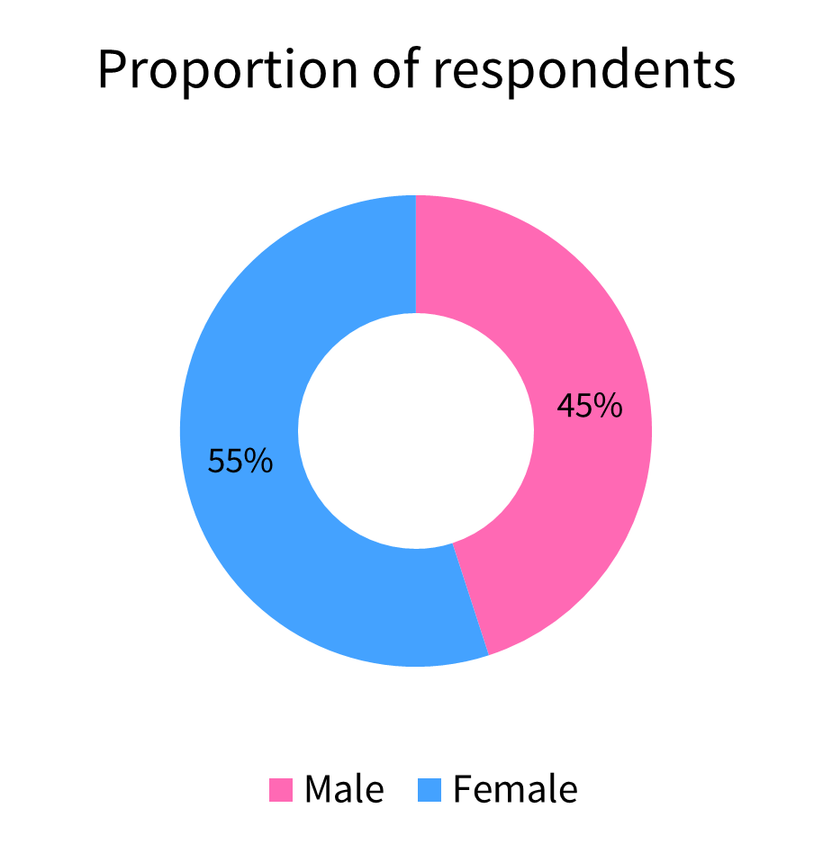
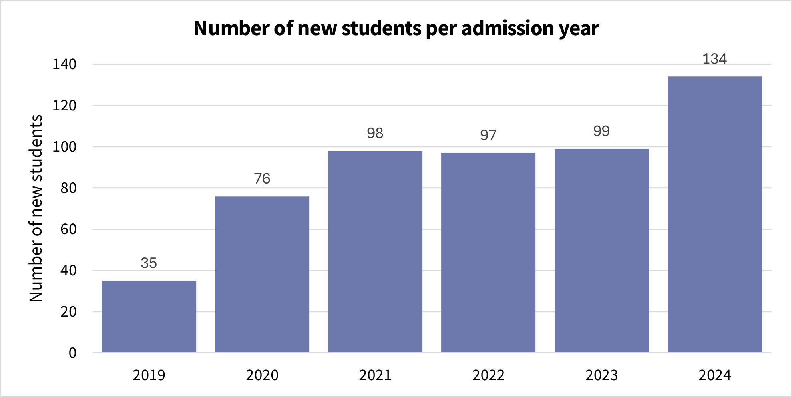
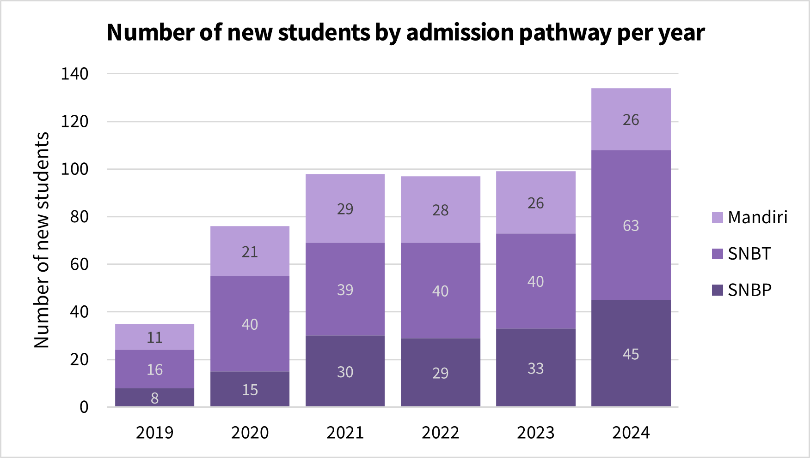
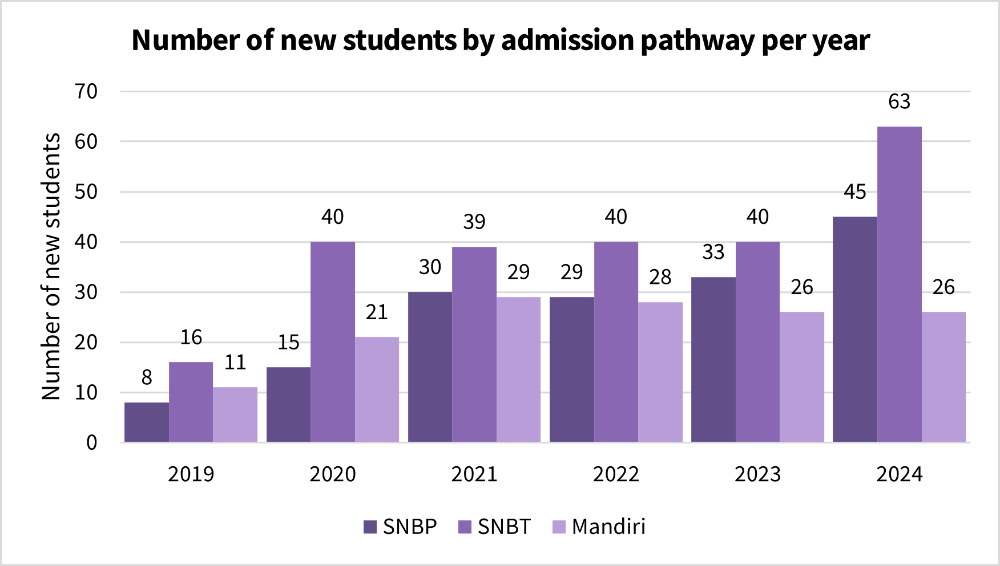
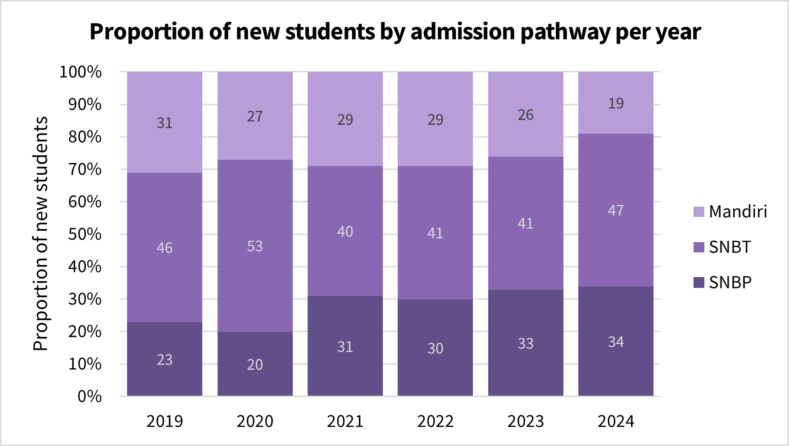
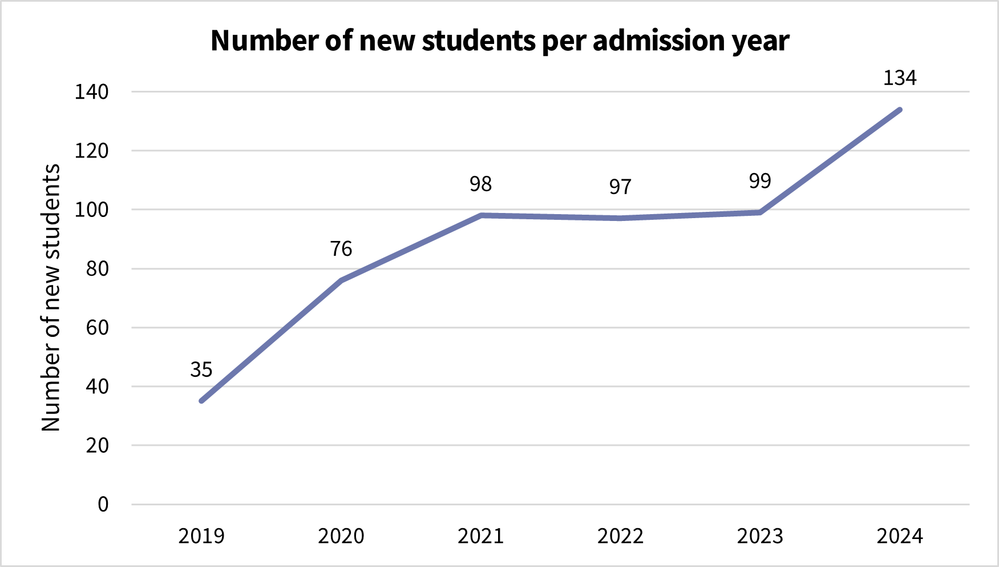

# Data visualization

**Data visualization** is the use of graphical tools to represent [data](data.md) in a clear, structured, and meaningful way. It helps reveal patterns, trends, differences, and relationships that may not be immediately visible in tables or raw numbers. In [veterinary biostatistics](veterinary-biostatistics.md), visualizations support decision-making, improve communication, and enhance the interpretation of clinical, epidemiological, and production data. Choosing the appropriate type of graph depends on the nature of the data and the message the researcher intends to communicate.

## Purpose and importance

Data visualization plays a critical role in transforming complex datasets into accessible insights. It allows researchers, veterinarians, and decision-makers to quickly grasp the key features of a dataset—such as central tendencies, variation, trends over time, and relationships between variables. While tables offer precision, visualizations provide clarity by highlighting patterns that may be obscured by raw numbers.

In veterinary contexts, effective visualization enhances data interpretation across a range of applications. For instance, a bar chart might reveal which chicken-rearing systems are most associated with avian influenza losses, while a line graph can illustrate how chicken mortality progressed over several days during an outbreak. Box plots can summarize the variability in flock size across villages, and scatter plots may help identify links between farmer education and vaccination practices.

Beyond analysis, visualization also strengthens communication. It enables veterinarians to present findings to farmers, policymakers, or the general public in a way that is intuitive and compelling. This is particularly important in animal health crises, where visual data can support risk communication, encourage biosecurity practices, or guide targeted interventions.

## Pie and doughnut chart

A pie chart is a circular graph divided into slices, where each slice represents a category’s proportion relative to the whole. A doughnut chart is a variation with a hollow center, offering a more modern look and space-efficient labeling without changing the interpretation.

These charts are designed to show parts of a whole, making them useful for highlighting proportions and percentages. For example, they can show the proportion of respondents who are male or female, or the distribution of vaccination status among a group of farmers.

Pie and doughnut charts are most effective when the number of categories is small—ideally between 2 and 4. When more categories are added, it becomes increasingly difficult for the reader to accurately judge the size of each slice, particularly when the differences are subtle. In such cases, a bar chart is more appropriate for comparison. Another important consideration is that pie charts emphasize relative comparison rather than exact values. Therefore, they are best used when proportions—not raw counts—are the focus of communication.

In the example below, the chart displays the proportion of male and female respondents in a veterinary survey. Females make up 55% of the participants, while males account for 45%. This visualization provides a quick, intuitive summary of group representation.

  

    
     <em>Figure 1. Pie chart: Proportion of respondents.</em>
  

  

    
     <em>Figure 2. Doughnut chart: Proportion of respondents.</em>
  

## Bar chart

A bar chart is one of the most common and effective tools for visualizing categorical data. It uses rectangular bars to represent the size or frequency of each category, making it easy to compare values across categories. The bars can be arranged vertically (known as a column chart) or horizontally, and the height (for vertical bars) or length (for horizontal bars) of each bar corresponds to a numerical value.

Bar charts are particularly useful for comparing quantities across categories, highlighting trends over time, or breaking down a total into subcategories. Several variants of bar charts exist, including the regular bar chart, grouped bar chart, stacked bar chart, and 100% stacked bar chart, each offering different strengths depending on the purpose of the analysis.

For example, the bar charts presented in this section are based on a table showing the number of new students admitted to a Veterinary Medicine Study Program over six years (2019–2024), categorized by three admission pathways: SNBP (formerly SNMPTN), SNBT (formerly SBMPTN), and Mandiri.

  <table>
    <thead>
      <tr>
        <th rowspan="2">Year of admission</th>
        <th colspan="3">Admission pathway</th>
        <th rowspan="2">Total number of new students</th>
      </tr>
      <tr>
        <th>SNMPTN/SNBP</th>
        <th>SBMPTN/SNBT</th>
        <th>Mandiri</th>
      </tr>
    </thead>
    <tbody>
      <tr><td>2019</td><td>8</td><td>16</td><td>11</td><td>35</td></tr>
      <tr><td>2020</td><td>15</td><td>40</td><td>21</td><td>76</td></tr>
      <tr><td>2021</td><td>30</td><td>39</td><td>29</td><td>98</td></tr>
      <tr><td>2022</td><td>29</td><td>40</td><td>28</td><td>97</td></tr>
      <tr><td>2023</td><td>33</td><td>40</td><td>26</td><td>99</td></tr>
      <tr><td>2024</td><td>45</td><td>63</td><td>26</td><td>134</td></tr>
    </tbody>
  </table>

The first type of bar chart is the regular bar chart. It shows each category as a separate bar with varying height. The example below displays the total number of new students admitted each year, without differentiating between admission pathways. It uses a single bar per year, allowing a straightforward view of how class size has grown over time—from just 35 students in 2019 to 134 in 2024. This format is especially suited for simple comparisons across categories.

  

    
     <em>Figure 3. Bar chart: Number of new students per admission year.</em>
  
 

The second chart is a stacked bar chart, where each bar represents a category and is subdivided into segments according to subcategories—in this case, the admission pathways. While it maintains the basic structure of a regular bar chart, the internal segments provide additional insight into the composition of each category. This format allows viewers to examine both the total class size and the relative contribution of each admission pathway. For example, it reveals that SNBP showed significant growth in 2021 and 2024, SNBT consistently accounted for the largest share, and the Mandiri pathway remained relatively stable across the years.

  

    
     <em>Figure 4. Stacked bar chart: Number of new students by admission pathway per admission year.</em>
  
 

The grouped bar chart—also known as a clustered or side-by-side bar chart—displays separate bars for each subcategory within each category. In this context, each year contains three adjacent bars representing the admission pathways. This arrangement is particularly useful for comparing the same subcategory across multiple categories or analyzing within-category differences more precisely than is possible with stacked bars. In the example below, this chart format helps highlight fluctuations in the number of students admitted through each pathway over time.

  

    
     <em>Figure 5. Grouped bar chart: Number of new students by admission pathway per admission year.</em>
  
 

The final variant is the 100% stacked bar chart. Unlike the previous formats, this version emphasizes the relative proportions of each subcategory rather than absolute numbers. Each bar has the same height, and the segments represent the percentage composition of admission pathways within each year. This format is particularly helpful when the focus is on composition rather than total size. From the chart, it is clear that the proportion of SNBT remained dominant across the six years, the share of SNBP increased in 2024, and the relative contribution of Mandiri declined slightly.

  

    
     <em>Figure 6. 100% stacked bar chart: Proportion of new students by admission pathway per admission year.</em>
  
 

In some cases, a horizontal bar chart may be more effective than the traditional vertical format. Horizontal bars are particularly helpful when category names are long or when the number of categories is large, as they allow better use of space and improve readability. This format also avoids crowding labels along the x-axis, which can become difficult to interpret in vertical charts. Like vertical bar charts, horizontal bar charts can also be modified into grouped, stacked, and 100% stacked versions, offering the same analytical benefits while improving clarity in situations where horizontal orientation is preferable.
An example is shown below using data from the 2020 Indonesian population census, which lists the ten provinces with the highest population. Since the province names are relatively long and the number of categories reaches ten, the horizontal format ensures that each label remains clear and legible. Each bar represents the total population of a province, making it easy to compare across regions.

In some cases, a horizontal bar chart may be more effective than the traditional vertical format. Horizontal bars are particularly helpful when category names are long or when the number of categories is large, as they allow better use of space and improve readability. This format also avoids crowding labels along the x-axis, which can become difficult to interpret in vertical charts. Like vertical bar charts, horizontal bar charts can also be modified into grouped, stacked, and 100% stacked versions, offering the same analytical benefits while improving clarity in situations where horizontal orientation is preferable.

An example is shown below using data from the 2020 Indonesian population census, which lists the ten provinces with the highest population. Since the province names are relatively long and the number of categories reaches ten, the horizontal format ensures that each label remains clear and legible. Each bar represents the total population of a province, making it easy to compare across regions.

  
A CHART WILL BE INSERTED HERE
  

# Line chart

A line chart is a graphical tool used to display data points connected by straight lines, often used to visualize changes or trends over time. Each point on the chart represents a value at a particular time, and the connecting lines make it easy to see increases, decreases, or fluctuations. Line charts are especially useful when the data follow a continuous, ordered sequence—such as days, months, or years—making them ideal for tracking patterns over time.

In the context of veterinary education, line charts can be used to show trends such as enrollment over the years, disease incidence across seasons, or changes in production indicators. The examples in this section use the same dataset on the admission of new students to a Veterinary Medicine Study Program from 2019 to 2024.

  

    
     <em>Figure 7. Line chart: Number of new students per admission year.</em>
  
 

  The first chart above is a regular line chart that shows the total number of new students admitted each year. The line connects six data points, making it easy to observe trends over time. In this case, we can see a sharp increase from 2019 to 2021, followed by a slight plateau, and then another rise in 2024. This format clearly highlights the general trend and direction of change.

    
TO BE CONTINUED
